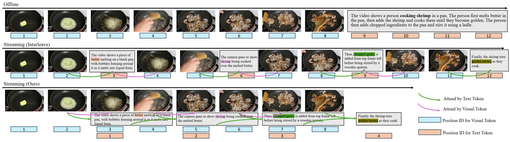

<div align="center">
<h1>Speak While Watching: Unleashing TRUE Real-Time Video Understanding Capability of Multimodal Large Language Models</h1> 
</div>

<div align="center">
<b>Junyan Lin</b><sup>1,2</sup>,
<b>Junlong Tong</b><sup>2,3</sup>,
<b>Hao Wu</b><sup>2</sup>,
<b>Jialiang Zhang</b><sup>2,4</sup>,
</div>

<div align="center">
<b>Jinming Liu</b><sup>2,3</sup>,
<b>Xin Jin</b><sup>2</sup>,
<b>Xiaoyu Shen</b><sup>2</sup>
</div>

<div align="center">
<sup>1</sup>Department of Computing, The Hong Kong Polytechnic University
</div>
<div align="center">
<sup>2</sup>Ningbo Key Laboratory of Spatial Intelligence and Digital Derivative, Institute of Digital Twin, EIT
</div>
<div align="center">
<sup>3</sup>Shanghai Jiao Tong University
</div>
<div align="center">
<sup>4</sup>Ocean University of China
</div>

<br>

<p align="center" width="100%">
<a target="_blank"></a>
</p>
<br>

<br>

<div align="center">

</div>
This repository is the unified implementation for **Speak While Watching: Unleashing TRUE Real-Time Video Understanding Capability of Multimodal Large Language Models**.

The project trains/evaluates on [PE-Video](https://huggingface.co/datasets/facebook/PE-Video), using `human_caption` as ground truth.


The figure compares three paradigms for video description:

- **Offline**: the model first watches the whole video and then describes it, which can cause temporal misalignment.
- **Interleaved streaming**: perception and generation alternate frame-by-frame, improving responsiveness but still constrained by positional continuity.
- **Parallel streaming (ours)**: positional continuity between input and output is relaxed, enabling perception and generation to run in parallel for true real-time understanding.

---

## What Is Kept

- One training script: `code/qwen-vl-finetune/scripts/sft.sh`
- One evaluation launcher: `eval.sh`
- One dataset preparation script: `mani_data.py`


## Directory

```text
Qwen2_5_vl_unified/
├── mani_data.py
├── eval.sh
├── dataset/                      
│   ├── PE-Video/
│   │   ├── train/*.json
│   │   └── test/*.json
│   ├── train_3_5.jsonl
│   └── test_3_5.jsonl
└── code/
    ├── qwen-vl-finetune/
    │   └── scripts/
    │       └── sft.sh
    └── evaluation/
        └── eval.py
```

## 1) Environment Setup

From project root:

```bash
# 1) Create and activate conda env
conda create -n qwen_stream python=3.10 -y
conda activate qwen_stream

# 2) Upgrade pip
pip install --upgrade pip

# 3) Install project dependencies
pip install -r requirements.txt

# 4) Install local qwen-vl-utils package used by training/eval
pip install -e code/qwen-vl-utils
```

Optional (speed-up): install `flash-attn` if your CUDA/toolchain is compatible.

## 2) Prepare PE-Video Dataset

From project root:

```bash
python mani_data.py
```

What `mani_data.py` does:

- checks local `dataset/PE-Video/train` and `dataset/PE-Video/test`
- if missing, downloads `facebook/PE-Video` from HuggingFace
- filters with:
  - `5 <= video_duration_in_s <= 30`
  - `3 <= token_len(human_caption) / duration <= 5`
- writes:
  - `dataset/train_3_5.jsonl`
  - `dataset/test_3_5.jsonl`

Tokenizer for counting tokens defaults to:

- `Qwen/Qwen2.5-VL-7B-Instruct`

## 3) Training

From project root:

```bash
cd code/qwen-vl-finetune
export QWEN2_5_VL_VARIANT=origin   # origin / batch / group / gap / overlap / interleave
export QWEN2_5_VL_MODEL_PATH=Qwen/Qwen2.5-VL-7B-Instruct
export QWEN2_5_VL_TRAIN_DATA=../dataset/train_3_5.jsonl
bash scripts/sft.sh
```

Output checkpoint:

- `code/qwen-vl-finetune/output/qwen2_5vl-pe-${QWEN2_5_VL_VARIANT}`

## 4) Evaluation

From project root:

```bash
export QWEN2_5_VL_VARIANT=origin
export QWEN2_5_VL_EVAL_MODEL_PATH=code/qwen-vl-finetune/output/qwen2_5vl-pe-origin
export QWEN2_5_VL_EVAL_DATA_DIR=dataset/test_3_5.jsonl
export QWEN2_5_VL_EVAL_IMG_ROOT=dataset/PE-Video/videos/test
bash eval.sh
```

Output file defaults to:

- `code/evaluation/output/${QWEN2_5_VL_VARIANT}_infer.json`

## Note on Parallelism

This repository does not implement true multi-GPU parallel execution for simultaneous perception and generation.
The current implementation focuses on position-id redesign and model adaptation to this position-id behavior.
In future work, we plan to release a true multi-GPU parallel implementation for end-to-end real-time deployment.

